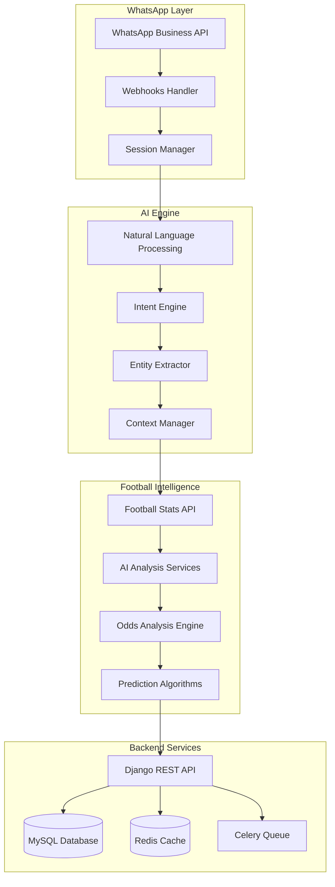

# WhatsApp Strategy - Mark Foot 📱⚽

## 🎯 Visão Estratégica

### Pivot Decision - Setembro 2025
**De:** Plataforma web de análise esportiva  
**Para:** Chatbot WhatsApp AI com foco em estatísticas + análise de odds

### Por que WhatsApp?
- **99% penetração** no mercado brasileiro
- **Baixa barreira de entrada** para usuários
- **Viral por natureza** - compartilhamento natural
- **Monetização direta** - pagamentos via links
- **Infraestrutura existente** - 100% reaproveitável

## 🤖 Arquitetura do Chatbot

### Core Components


### Message Flow
1. **User sends message** → WhatsApp Business API
2. **Webhook receives** → Message parser
3. **NLP processes** → Intent recognition
4. **Entity extraction** → Teams, players, matches
5. **Context awareness** → Previous conversation
6. **Data retrieval** → Football APIs + Database
7. **AI analysis** → Odds intelligence + predictions
8. **Response formatting** → WhatsApp-friendly format
9. **Send response** → WhatsApp Business API

## 🎯 User Experience Design

### Conversation Examples

#### Basic Stats Query
```
User: "Como está o Flamengo na temporada?"

Bot: ⚽ Flamengo - Temporada 2025
📊 Posição: 2º lugar no Brasileirão
🏆 21 jogos | 13V | 5E | 3D
⚽ 38 gols pró | 15 contra
📈 Últimos 5: V-V-E-V-V

💡 Quer análise mais detalhada? /premium
```

#### Odds Analysis (Premium)
```
User: "Odds do Flamengo x Palmeiras amanhã"

Bot: 🎲 Flamengo x Palmeiras - Análise de Odds

Casa de Apostas:
• Flamengo: 2.10 (47.6% prob.)
• Empate: 3.20 (31.3% prob.)  
• Palmeiras: 3.50 (28.6% prob.)

🧠 Por que essas odds?
✅ Flamengo favorito (casa + forma)
⚠️ Palmeiras sem 3 titulares
📊 Histórico: 60% vitórias Fla em casa

💎 Value bet detectado em "Empate"
Probabilidade real: 35% vs odds 31%

📈 Ver análise completa: /detailed_analysis
```

#### Match Prediction
```
User: "Previsão Real Madrid x Barcelona"

Bot: 🔮 El Clásico - Previsão IA

🤖 Modelo Mark Foot:
• Real Madrid: 45% (2.22 odds)
• Empate: 25% (4.00 odds)
• Barcelona: 30% (3.33 odds)

📊 Fatores-chave:
✅ Real: melhor ataque (2.8 gols/jogo)
⚠️ Barça: 2 desfalques importantes
🏠 Santiago Bernabéu (80% aproveitamento)

💰 Comparação com mercado:
Bet365: Real 2.10 | Empate 3.20 | Barça 3.50
⭐ Melhor value: Real Madrid (+5.7%)

🔔 Quer alertas de mudanças? /alerts_on
```

### Interactive Features

#### Quick Replies
- 📊 "Estatísticas"
- 🎲 "Odds Hoje"  
- 🔮 "Previsões"
- ⭐ "Meus Times"
- 💎 "Premium"
- ⚙️ "Configurações"

#### Rich Media Support
- **Gráficos**: Chart.js images via WhatsApp
- **Tabelas**: Formatted text tables
- **PDFs**: Premium reports via link
- **Videos**: Highlights integration (futuro)

## 💰 Monetization Strategy

### Freemium Tiers

#### 🆓 Free Plan
- **5 consultas/dia**
- Estatísticas básicas de times/jogadores
- Odds simples (sem análise)
- Grupos públicos
- Suporte via bot

#### 💎 Premium Plan (R$ 19,90/mês)
- **Consultas ilimitadas**
- Análise completa de odds
- Previsões AI detalhadas
- Alertas personalizados
- Grupos VIP
- Suporte prioritário

#### 🏆 Pro Plan (R$ 49,90/mês)
- **Tudo do Premium +**
- Relatórios PDF personalizados
- API access para desenvolvedores
- Análises históricas profundas
- Consultoria 1:1 mensal
- White-label option

### Payment Integration
```python
# WhatsApp Payment Flow
1. User hits paywall → "Upgrade to Premium?"
2. Bot generates payment link → Stripe/PagSeguro
3. User completes payment → Webhook notification
4. Bot updates user tier → "Premium activated! 🎉"
5. Full access unlocked → Advanced features available
```

### Revenue Projections
| Período | Free Users | Premium | Pro | MRR |
|---------|------------|---------|-----|-----|
| Mês 3 | 4,200 | 400 | 60 | R$ 15.5K |
| Mês 6 | 20,000 | 1,800 | 400 | R$ 93K |
| Mês 12 | 75,000 | 6,000 | 1,600 | R$ 375K |

## 🚀 Technical Implementation

### Phase 1: MVP (4-6 weeks)
```python
# Core Components
1. WhatsApp Business API Setup
   - Meta Business verification
   - Webhook endpoint creation
   - Message handling system

2. Basic NLP Engine
   - Intent recognition (teams, players, matches)
   - Entity extraction
   - Context management

3. Integration with existing APIs
   - Football-Data.org integration
   - AI services connection
   - Response formatting

4. User Management
   - Session handling
   - Rate limiting
   - Basic analytics
```

### Phase 2: Premium Features (4-6 weeks)
```python
# Advanced Features
1. Odds Integration
   - Multiple betting API connections
   - Real-time odds monitoring
   - AI analysis engine

2. Payment System
   - WhatsApp payment links
   - Subscription management
   - Tier-based access control

3. Advanced AI
   - Match predictions
   - Player analysis
   - Market intelligence

4. User Experience
   - Rich media support
   - Interactive messages
   - Personalization
```

### Technology Stack
```yaml
WhatsApp Integration:
  - WhatsApp Business API (Meta)
  - Twilio (backup option)
  - 360Dialog (enterprise option)

NLP & AI:
  - Python NLTK/spaCy
  - Existing AI services (8 models)
  - OpenAI GPT integration (futuro)

Backend:
  - Django 4.2 (existing)
  - Celery + Redis (existing) 
  - MySQL 8.0 (existing)

External APIs:
  - Football-Data.org (existing)
  - Betting APIs (new)
  - Payment gateways (existing)
```

## 📈 Growth Strategy

### Launch Strategy
1. **Soft Launch** (Semana 1-2)
   - 50 beta users (amigos/família)
   - Collect feedback
   - Fix critical bugs

2. **Closed Beta** (Semana 3-4)
   - 200 selected users
   - Influencer partnerships
   - Feature refinement

3. **Public Launch** (Mês 2)
   - Marketing campaign
   - Social media push
   - Press release

### Marketing Channels
- **WhatsApp Groups**: Futebol enthusiasts
- **Social Media**: Instagram, Twitter, TikTok
- **Influencers**: Football content creators
- **Partnerships**: Sports media, podcasts
- **SEO**: "estatísticas futebol WhatsApp"

### Viral Mechanisms
- **Share Results**: Easy sharing of analysis
- **Referral Program**: Free premium days
- **Group Features**: Team-specific groups
- **Social Proof**: "1000+ users trust us"

## 🌍 International Expansion

### Language Support Roadmap
1. **Portuguese** (Q4 2025) ✅
2. **English** (Q1 2026) - UK, US markets
3. **Spanish** (Q2 2026) - LATAM expansion
4. **French** (Q3 2026) - Africa/France
5. **German** (Q4 2026) - DACH region

### Market Entry Strategy
```yaml
Brazil (Home Market):
  - Focus: Brasileirão + International tournaments
  - Partnerships: Globo, SporTV
  - Payment: PIX, boleto, cartão

Argentina:
  - Focus: Liga Argentina + Copa América
  - Partnerships: TyC Sports, Olé
  - Payment: Peso argentino, USD

Mexico:
  - Focus: Liga MX + CONCACAF
  - Partnerships: ESPN México
  - Payment: Peso mexicano, USD

Europe:
  - Focus: Premier League, La Liga, etc.
  - Partnerships: Sky Sports, ESPN
  - Payment: EUR, GBP
```

## 🔒 Compliance & Security

### Data Protection
- **LGPD Compliance** (Brazil)
- **GDPR Ready** (Europe expansion)
- **User consent** for data collection
- **Right to deletion** implementation

### Responsible Gambling
- **Educational content** about odds
- **Risk warnings** for betting
- **Spending alerts** for premium users
- **Partnership transparency**

### Security Measures
- **Webhook verification** (Meta signatures)
- **Rate limiting** per user/IP
- **Data encryption** in transit/rest
- **Secure payment** processing

## 📊 Success Metrics

### User Engagement
- **Daily Active Users** (DAU)
- **Monthly Active Users** (MAU)
- **Messages per user** per day
- **Session duration** average
- **Feature usage** analytics

### Business Metrics
- **Conversion Rate** (Free → Premium)
- **Churn Rate** monthly
- **Customer Lifetime Value** (CLV)
- **Monthly Recurring Revenue** (MRR)
- **Customer Acquisition Cost** (CAC)

### Technical Metrics
- **Response Time** < 2 seconds
- **Uptime** > 99.9%
- **Message Delivery Rate** > 98%
- **Error Rate** < 1%

---

## 🎯 Próximos Passos Imediatos

### Semana 1 (Setembro 1-7, 2025)
- [ ] **WhatsApp Business Account** setup
- [ ] **Meta Business** verification process
- [ ] **Development environment** preparation
- [ ] **Basic webhook** implementation

### Semana 2 (Setembro 8-14, 2025)
- [ ] **NLP engine** basic implementation
- [ ] **Existing API integration** with WhatsApp
- [ ] **User session** management
- [ ] **First working prototype**

### Semana 3-4 (Setembro 15-28, 2025)
- [ ] **Betting APIs** integration
- [ ] **Payment system** connection
- [ ] **Beta testing** with 50 users
- [ ] **Iteration** based on feedback

### Outubro 2025
- [ ] **Public launch** preparation
- [ ] **Marketing campaign** execution
- [ ] **Partnership** negotiations
- [ ] **Scale infrastructure**

---
*Documento criado em: 1 de setembro de 2025*
*Estratégia aprovada e implementação iniciada*
